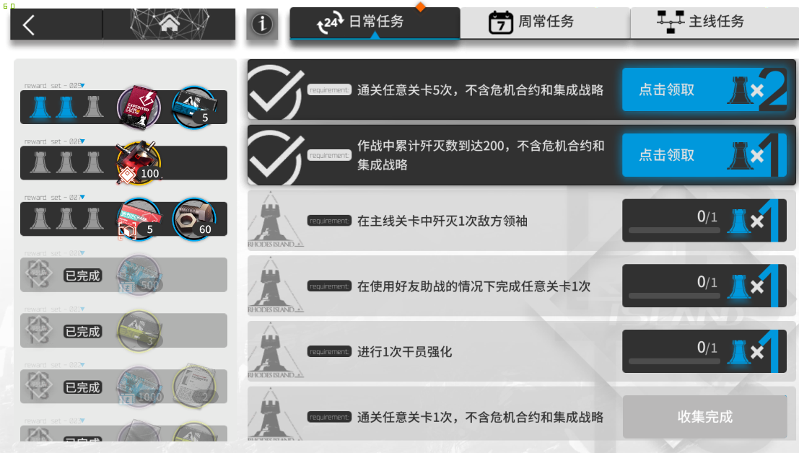
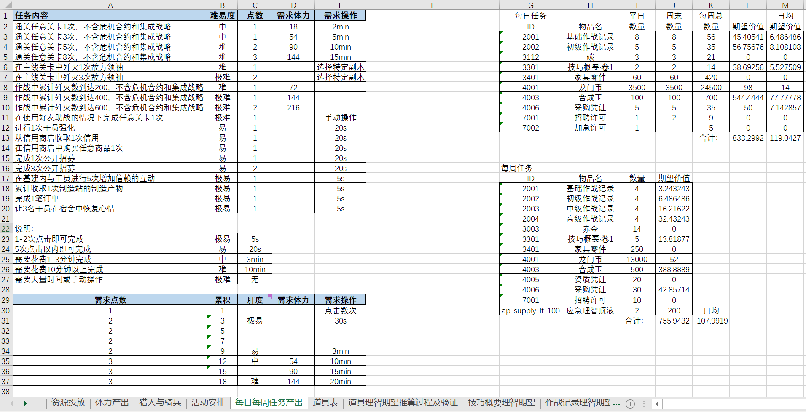

## 前言
在作为一个玩家刷体力时，我能隐约感觉，每日登录两次正常消耗掉所有体力值时，能刚好舒服地完成完成所有的每日任务。因此现在从一个数值策划的角度反推、感受、学习舟舟的每日任务设置节奏。

虽然舟舟的大部分数据是完全在客户端可见的，但是做一个抄录员也太没意思了，于是基于[网上的解包数据](https://github.com/Kengxxiao/ArknightsGameData),我写了点代码[将JSON数据反写回Excel](https://github.com/TXINX/ArknightsAnalysis)，增强可读性。并在此基础上进行分析。

## 任务系统
### 每日任务

舟舟的任务系统有几个特点：
 - 每日的任务目标/奖励内容有所不同（特殊活动期间会完全变更）
 - 完成任务直接获得的是巴别塔状的代币(PeriodicalPoint)，而足够数量的代币会自动触发奖励的兑换。

首先我们看下任务表的结构
任务表分为几个子表：mission missionGroup periodicalRewards weeklyRewards dailyMissionPeriodInfo

### dailyMissionPeriodInfo表
记录每日任务模式变更的周期，startTime和endTime都是导出来的Unix时间，从某日4:00:00开始到某日3:59:59结束，periodList是两个字典组成的列表，其中每个字典中period表示应用该每日任务模板的日期，舟舟是区分了平日和周末两种模板，每个模板中有对应的任务组和奖励组。

### missionGroup表 & periodicalRewards表

这里比较奇怪的是奖励表没有专门为奖励组做一个子表，而任务组却有一个missionGroup来通过任务组来索引子任务。理论上在设计表时不应该让同一份数据被策划填两次，这里我的猜想是程序在导表时为了查询方便而为正向和反向各建了一套JSON引用。

### mission表

这个子表基本是任务系统的核心，除了日常任务之外还有主线/支线任务的数据在这里，他们共用了任务相关的大多数字段，像sortId决定了客户端显示的顺序，template决定了任务完成的触发目标。但相对不同的是日常任务会获得代币(PeriodicalPoint),而主线支线会直接得到奖励(rewards)。整体上来看，表中没有冗余的列，设计的很清爽。

## 系统拆解

上图左侧是对每日任务的完成节奏的拆解，右侧是对投放物资的拆解。

### 任务目标

由于舟舟的定位是低肝度/重策略/体力制，对于每日任务，我们在设计的时候肯定有如下期待：

 1. 每日任务是其他系统的附属，应被动地跟随玩家体力消耗而完成
 2. 应鼓励玩家合理上线利用体力 （因此决不允许一管体力120~140可以简单完成每日任务）

我们逐条解析上面两个期望目标：

对于1，我个人将“任务”分为两种，强引导型与被动型。以炉石传说为例，同样作为低肝度/重策略的手游，其任务就是强引导型的，明确告诉玩家，你需要使用XX种族、职业、或进行XX行为来完成任务。为什么会这样？我的理解是因为其并没有直观的养成线，玩家在上线时会丧失目标感不知道该干什么，在这样的游戏中，每日任务是作为指引而存在的。而被动型的任务设计是其他系统的附庸，尤其是体力制游戏中，通常合理使用完体力就会得到每日任务的奖励，在这种情况下，每日任务起到的作用主要是通过奖励呼唤玩家上线。

对于2，我们考虑玩家时间最紧张的状态，玩家希望用最少的时间完成最多的每日任务，那么除了点击型任务外，玩家不得不打本时，会考虑30体的资源本或36体的芯片本，一管体力刚好够打4次，总花费约10min，那么是否允许这类玩家完成所有每日任务，以及如果不能应该给他留下多少的奖励，这就是需要策划来考虑的内容。从舟舟的最终设计上来看，尽管整体上相当宽松，但也希望玩家能在游戏中花费更多的时间，而不是每日一刷的登录频率。玩家可以通过选择BOSS关卡（通常战斗时长长于普通关卡）/使用额外体力药/当日第二次登录来完成所有每日任务。

而我们考虑玩家时间最宽裕的状态，能消耗每日240点体力时，几乎所有任务都会在刷体力的过程中自然而然地完成，玩家不需要关注其内容。这就更反向验证了舟舟的每日任务的目的性，就是拉上线并投放物资。

### 物资分析

单独拉一个系统的产出来说其实意义不大，主要是关注全局中各系统的占比，这里值得注意的是每日/每周任务的总投放已经达到了和体力恢复相同的数量。舟舟的物资投放一共有4大来源：

- 体力自然恢复
- 活动投放
- 每日任务/签到/每周任务
- 基建每日产出

在之后的拆解中，我会将这几大来源全部纳入讨论，从宏观上分析学习舟游的封闭经济系统组成。